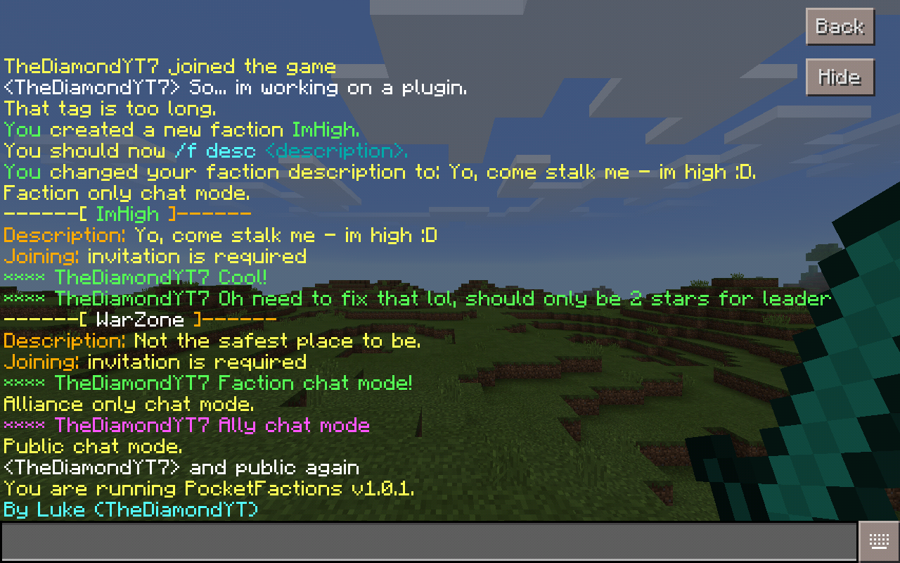

# PocketFactions
A full-featured Factions plugin for [PocketMine-MP](https://github.com/pmmp/PocketMine-MP).

# What works?

* Creating factions
* Changing faction description
* Changing faction leader
* Basic faction chat
* Basic listing of faction info

# Commands
- /f help <page> 
- /f create <faction name>
- /f disband
- /f chat <mode> (alias: c)
- /f description <new description> (alias: desc)
- /f tag <new tag>
- /f leader <player>
- /f show [faction name]
- /f reload
- /f version (alias: ver,v)

I put a ton of work into this to make it as close to [PC Factions](https://github.com/MassiveCraft/Factions) (The old version, not the s**t new one).
So please, give the repo a star.

## TODO
See [#1](https://github.com/TheDiamondYT1/PocketFactions/issues/1)

## Stalk me  
Stalk my social media, please.  

* [Twitter](https://twitter.com/TheDiamondYT)  
* [PocketMine Forums](https://forums.pmmp.io/members/thediamondyt.622/)  
* [Instagram](https://instagram.com/bruhitzzluke)  
* [Snapchat (lukedabs21)](http://snapchat.com/add/lukedabs21)   
* MCPE Username: TheDiamondYT7
  
## Credit
The command code is based off (but not completely copied from) [MyPlot](https://github.com/wiez/MyPlot) by Wies. Thank you!
